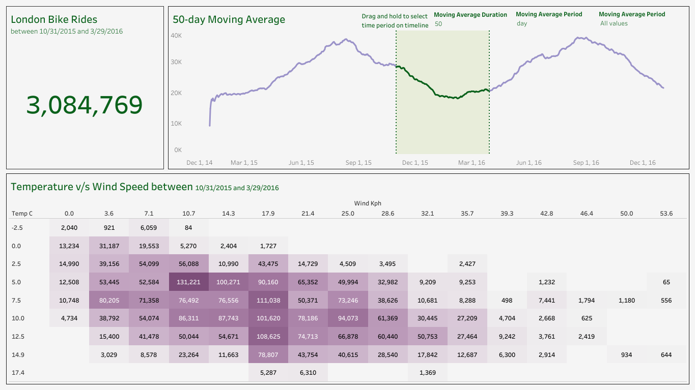

# London Bike Rides Analysis

Explore, analyze, and visualize London’s bike-sharing data using Python and Tableau. This project leverages Python libraries such as Pandas and NumPy for data preprocessing and builds interactive dashboards in Tableau to uncover patterns and trends.

## Table of Contents

- [Introduction](#introduction)  
- [Dataset Information](#dataset-information)  
- [Project Goals](#project-goals)  
- [Key Visualizations](#key-visualizations) 
- [Observations from the Dashboard](#observations-from-the-dashboard)  
- [Technologies Used](#technologies-used)  
- [Future Work](#future-work)  
- [License](#license)  
- [Acknowledgments](#acknowledgments)  

---

## Introduction

This project analyzes bike-sharing data in London to uncover valuable insights about usage trends based on environmental factors, time, and weather. These insights aim to support city planners, businesses, and the general public in making informed decisions about bike-sharing programs.

---

## Dataset Information

The dataset used is from [Kaggle](https://www.kaggle.com/datasets/hmavrodiev/london-bike-sharing-dataset). The data is grouped by **"Start Time"** (hourly intervals), representing the count of new bike shares, excluding long-duration shares.

### Metadata Description:
| **Column**         | **Description**                                                                                  |
|---------------------|--------------------------------------------------------------------------------------------------|
| `timestamp`         | Timestamp field for grouping data (hourly).                                                     |
| `cnt`               | Count of new bike shares.                                                                       |
| `t1`                | Actual temperature in Celsius.                                                                 |
| `t2`                | "Feels like" temperature in Celsius.                                                            |
| `hum`               | Humidity percentage.                                                                            |
| `wind_speed`        | Wind speed in km/h.                                                                             |
| `weather_code`      | Weather category code (see description below).                                                  |
| `is_holiday`        | Boolean field: **1** for holiday, **0** for non-holiday.                                        |
| `is_weekend`        | Boolean field: **1** if the day is a weekend, **0** otherwise.                                  |
| `season`            | Meteorological season: **0 - Spring**, **1 - Summer**, **2 - Fall**, **3 - Winter**.            |

### `weather_code` Categories:
- **1**: Clear or mostly clear (includes some haze/fog).  
- **2**: Scattered clouds or few clouds.  
- **3**: Broken clouds.  
- **4**: Cloudy.  
- **7**: Rain or light rain shower.  
- **10**: Rain with thunderstorm.  
- **26**: Snowfall.  
- **94**: Freezing fog.  

This comprehensive metadata enables correlations between bike-sharing patterns and environmental or temporal factors.

---

## Project Goals

The primary objectives of this project are to:

1. **Understand Usage Trends**: Analyze how factors like weather, day of the week, or time influence bike usage.  
2. **Visualize Data**: Build interactive dashboards to highlight trends and correlations.  
3. **Provide Actionable Insights**: Enable better management of bike-sharing systems through data-backed analysis.  

---

## Key Visualizations

An interactive Tableau dashboard showcases the analysis. Access it here: [London Bike Rides Dashboard](https://public.tableau.com/app/profile/abhisekh.nayak/viz/LondonBikeRides-TimelinewithHeatmap/Dashboard1).

### Dashboard Features:
- **Timeline**: Visualizes daily and hourly bike-sharing activity.  
- **Heatmap**: Highlights peak usage hours by day of the week.  
- **Weather Insights**: Demonstrates how temperature, humidity, and weather conditions influence bike rentals.  

---

## Observations from the Dashboard

The following key insights were derived from the visualizations:

1. **Total Bike Rides**:
   - The total number of bike rides during the selected period (**October 31, 2015 – March 29, 2016**) was **3,084,769**.

2. **50-Day Moving Average**:
   - The timeline visualization with a **50-day moving average** highlights **seasonal trends**:
     - Bike rides **peak during warmer months** (summer).  
     - Usage declines during colder months, especially in winter.  
   - The moving average smooths short-term fluctuations, making long-term trends visible.

3. **Temperature vs. Wind Speed Heatmap**:
   - **Temperature Influence**:
     - The highest bike usage occurs between **5°C to 10°C** and slightly reduces at higher temperatures.  
     - Extremely cold temperatures (**below 0°C**) see significantly lower activity.  
   - **Wind Speed Influence**:
     - Bike rides are higher when wind speeds are moderate (**3.6–14.3 km/h**).  
     - Higher wind speeds (**above 28 km/h**) correlate with reduced bike usage.  
   - **Ideal Conditions**:
     - Moderate temperatures (5–15°C) combined with low-to-moderate wind speeds encourage bike usage.

4. **Impact of Environmental Conditions**:
   - Seasonal and weather-related factors (like wind speed and temperature) have a clear influence on bike-sharing activity.  

---

## Technologies Used

### Data Processing
- **Python**:
  - **Pandas**: For cleaning, transforming, and analyzing data.  
  - **NumPy**: For efficient numerical computations.  

### Visualization
- **Tableau**:
  - Developed a highly interactive dashboard for exploratory data analysis.  
  - Hosted publicly via [Tableau Public](https://public.tableau.com/).

---

## Future Work

1. **Enhanced Visualizations**: Include geospatial maps for rental stations.  
2. **Prediction Models**: Build machine learning models to forecast bike usage.  
3. **Real-Time Dashboards**: Integrate live data streams for updated insights.

---

## License

This project is licensed under the MIT License. See the [LICENSE](LICENSE) file for details.

---

## Acknowledgments

- **Dataset**: Provided by Hristo Mavrodiev on Kaggle. Explore it [here](https://www.kaggle.com/datasets/hmavrodiev/london-bike-sharing-dataset).  
- **Visualization Hosting**: Tableau dashboard hosted on [Tableau Public](https://public.tableau.com/).  
- **Inspiration**: Supported by the bike-sharing programs in urban areas globally.  

---
